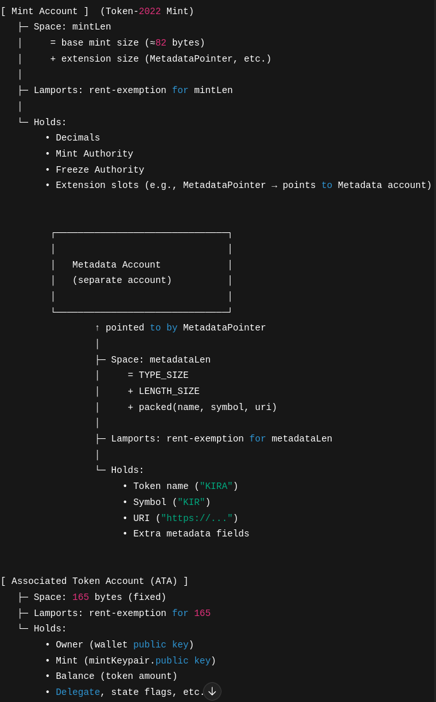

#  Solana Token Launchpad (React + Token-2022)

This project is a **React-based Solana Token Launchpad** that allows users to **create and mint SPL tokens (Token-2022)** directly from their wallet. It uses the **Solana Wallet Adapter** and the `@solana/web3.js` + `@solana/spl-token`+ `@solana/spl-token-metadata` libraries.

---

## ✨ Features
- Connect wallet using [solana-wallet-adapter-react]
- Create a new **SPL Token (Token-2022 standard)** with metadata.
- Initialize and store metadata (name, symbol, URI).
- Create an **Associated Token Account** for the wallet.
- Mint an initial supply of tokens to your wallet.

---

##  Tech Stack
- **React + Vite** (frontend)
- **@solana/web3.js** – Solana transactions
- **@solana/wallet-adapter** – wallet connection
- **@solana/spl-token** + **@solana/spl-token-metadata** – Token-2022 program

---

## 📦 Installation

1. Clone the repository:
   ```bash
   git clone https://github.com/siyasjr/sol-token-launchpad.git
   cd solana-token-launchpad

2. npm install

3. npm run dev


##  How It Works

1. Connect Wallet

Ensure you have a Solana wallet (e.g., Phantom) installed and connected.

2. Fill in Token Details


Name → Token display name

Symbol → Token ticker (e.g., $MYT)

Metadata URI → Link to off-chain metadata JSON

Initial Supply → Number of tokens to mint initially

3. Create Token

Click Create Token, and the app will:

Generate a new mint account

Initialize metadata (name, symbol, URI)

Create an associated token account

Mint the initial supply to your wallet


# Flow of Accounts : 



## License

MIT License. Free to use and modify.


## Contributing

Pull requests are welcome! If you’d like to improve this project (UI, functionality, docs), feel free to fork and submit a PR.


